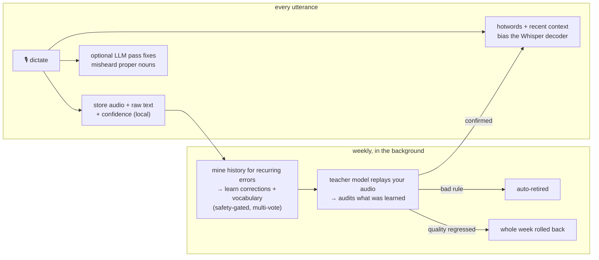

# voiceio

```
 ██╗   ██╗ ██████╗ ██╗ ██████╗███████╗██╗ ██████╗
 ██║   ██║██╔═══██╗██║██╔════╝██╔════╝██║██╔═══██╗
 ██║   ██║██║   ██║██║██║     █████╗  ██║██║   ██║
 ╚██╗ ██╔╝██║   ██║██║██║     ██╔══╝  ██║██║   ██║
  ╚████╔╝ ╚██████╔╝██║╚██████╗███████╗██║╚██████╔╝
   ╚═══╝   ╚═════╝ ╚═╝ ╚═════╝╚══════╝╚═╝ ╚═════╝
```

[](https://github.com/Hugo0/voiceio/actions/workflows/ci.yml)
[](https://pypi.org/project/python-voiceio/)
[](https://pypi.org/project/python-voiceio/)
[](LICENSE)
[](https://pepy.tech/projects/python-voiceio)

Voice dictation for Linux. Local, yours, and it learns how you speak.

https://github.com/user-attachments/assets/9cf5d1ac-b4bb-4cf8-b775-7a66dc16b376

Open-source, sovereign voice input/output. Your speech is transcribed on your own machine, everything it learns about you stays in local files you own, and it gets better the more you use it.

- **Local & sovereign** — speech is transcribed on-device with [faster-whisper](https://github.com/SYSTRAN/faster-whisper); audio never leaves the machine. Your history, retained audio, corrections, and vocabulary all live in plain local files (JSONL / TOML / txt) you can read, edit, and delete. Zero telemetry. The one honest nuance: two *optional, off-by-default* features send text (never audio) to a cloud LLM you configure yourself — final-transcript polish (`[postcorrect]`) and the weekly correction-mining review.
- **Improves with use — automatically** — every utterance teaches it your words and names. See [How it learns](#how-it-learns).
- **Linux-first & hackable** — Wayland/X11, GNOME/KDE/sway/i3, chosen automatically by chain-and-probe backends. It's plain Python you can read in an afternoon and [contribute to](CLAUDE.md).

> **Linux-first.** voiceio is developed and tested daily on Linux (GNOME/Wayland). Windows and macOS ship as **experimental, untested** targets — the code paths exist but are unmaintained and likely broken. See [Experimental platforms](#experimental-platforms).

## Quick start

```bash
# 1. Install system dependencies (Ubuntu/Debian)
sudo apt install pipx ibus gir1.2-ibus-1.0 python3-gi python3-dev portaudio19-dev

# 2. Install voiceio
pipx install python-voiceio

# 3. Run the setup wizard
voiceio setup
```

That's it. Press **Ctrl+Alt+V** (or your chosen hotkey) to start dictating.

<details>
<summary><strong>Fedora</strong></summary>

```bash
sudo dnf install pipx ibus python3-gobject python3-devel portaudio-devel
pipx install python-voiceio
voiceio setup
```
</details>

<details>
<summary><strong>Arch Linux</strong></summary>

```bash
sudo pacman -S python-pipx ibus python-gobject portaudio
# Note: Arch includes Python headers by default with the python package
pipx install python-voiceio
voiceio setup
```
</details>

<details>
<summary><strong>Windows / macOS (experimental)</strong></summary>

See [Experimental platforms](#experimental-platforms) below — these builds are untested and unmaintained.
</details>

<details>
<summary><strong>Build from source</strong></summary>

If you want the source code locally to hack on or customize for personal use. PRs are welcome!

```bash
git clone https://github.com/Hugo0/voiceio
cd voiceio
uv pip install -e ".[linux,dev]"

# Bootstrap CLI commands onto PATH (creates ~/.local/bin/voiceio)
uv run voiceio setup
```

> **Note:** Source installs live inside a virtualenv, so `voiceio` isn't on PATH until setup creates symlinks in `~/.local/bin/`. If `voiceio` isn't found after setup, restart your terminal or run `export PATH="$HOME/.local/bin:$PATH"`.
</details>

> You can also install with `uv tool install python-voiceio` or `pip install python-voiceio`.

## How it works

```
hotkey → mic capture → whisper (local) → text at cursor
          pre-buffered   streaming        IBus / clipboard
```

Press your hotkey to start recording (1s pre-buffer catches the first syllable). Text streams into the focused app as an underlined preview. Press again to commit. Transcription runs locally via [faster-whisper](https://github.com/SYSTRAN/faster-whisper), text is injected through IBus (any GTK/Qt app) with clipboard fallback for terminals. It runs in real time on a modern CPU and ships with model tiers from `tiny` to `large-v3`.

## How it learns

Most dictation tools transcribe the same way on day 100 as on day 1. voiceio adapts to *you* — your jargon, names, and accent — entirely from data that never leaves your machine.



1. **Capture** — every utterance stores its audio, raw text, and confidence in local files.
2. **Bias** — your vocabulary and recent context steer the Whisper decoder (hotwords / prompt) on every recording.
3. **Contextual fix** — an optional LLM pass repairs misheard proper nouns using surrounding context.
4. **Mine** — a weekly background job scans your history for recurring errors and auto-learns corrections and vocabulary. Multi-vote adjudication and a protected-languages guard (for bilingual users) keep it safe; it never asks you to triage.
5. **Audit** — a teacher model (a larger Whisper) replays your retained audio to verify what was learned. Bad rules are retired automatically, and a system-level drift metric rolls back an entire week of learning if quality regressed.

Rules are always **probationary, never tenured** — anything that stops helping is dropped. Your only touchpoint is an occasional desktop notification telling you what was learned.

## Features

- **Streaming**: text appears as you speak, not after you stop
- **Works everywhere**: IBus input method for GUI apps, clipboard for terminals
- **Wayland + X11**: evdev hotkeys work on both, no root required
- **Pre-buffer**: never miss the first syllable
- **Voice commands**: "new line", "comma", "scratch that", punctuation by name
- **Autocorrect**: LLM-powered review of recurring Whisper mistakes (`voiceio correct`)
- **Text-to-speech**: hear selected text spoken back (Piper, eSpeak, Edge TTS)
- **Smart post-processing**: numbers ("twenty five" → "25"), punctuation, capitalization
- **Auto-healing**: falls back to the next working backend if one fails
- **Autostart**: optional systemd service, restarts on crash
- **Self-diagnosing**: `voiceio doctor` checks everything, `--fix` repairs it

## Models

| Model | Size | Speed | Accuracy | Good for |
|-------|------|-------|----------|----------|
| `tiny` | 75 MB | ~10x realtime | Basic | Quick notes, low-end hardware |
| `base` | 150 MB | ~7x realtime | Good | Daily use (default) |
| `small` | 500 MB | ~4x realtime | Better | Longer dictation |
| `medium` | 1.5 GB | ~2x realtime | Great | Accuracy-sensitive work |
| `large-v3` | 3 GB | ~1x realtime | Best | Maximum quality, GPU recommended |

Models download automatically on first use. Switch anytime: `voiceio --model small`.

## Commands

```
voiceio                  Start the daemon
voiceio setup            Interactive setup wizard
voiceio doctor           Health check (--fix to auto-repair)
voiceio test             Test microphone + live transcription
voiceio demo             Interactive guided tour of all features
voiceio toggle           Toggle recording on a running daemon
voiceio correct          Review and fix recurring transcription errors
voiceio history          View transcription history
voiceio update           Update to latest version
voiceio service install  Autostart on login (systemd / Windows Startup)
voiceio logs             View recent logs
voiceio uninstall        Remove all system integrations
```

## Configuration

`voiceio setup` handles everything interactively. To tweak later, edit the config file or override at runtime:

- Linux/macOS: `~/.config/voiceio/config.toml`
- Windows: `%LOCALAPPDATA%\voiceio\config\config.toml` (see [Experimental platforms](#experimental-platforms))

```bash
voiceio --model large-v3 --language auto -v
```

See [config.example.toml](config.example.toml) for all options.

## Troubleshooting

```bash
voiceio doctor           # see what's working
voiceio doctor --fix     # auto-fix issues
voiceio logs             # check debug output
```

| Problem | Fix |
|---------|-----|
| No text appears | `voiceio doctor --fix` - usually a missing IBus component or GNOME input source |
| Hotkey doesn't work on Wayland | `sudo usermod -aG input $USER` then log out and back in |
| Transcription too slow | Use a smaller model: `voiceio --model tiny` |
| Want to start fresh | `voiceio uninstall` then `voiceio setup` |
| Windows / macOS issues | These platforms are experimental and untested — see [Experimental platforms](#experimental-platforms) |

## Platform support

voiceio targets **Linux**. That's what it's developed and tested against.

| Platform | Status | Text injection | Hotkeys | Streaming preview |
|----------|--------|---------------|---------|-------------------|
| Ubuntu / Debian (GNOME, Wayland) | **Tested daily** | IBus | evdev / GNOME shortcut | Yes |
| Ubuntu / Debian (GNOME, X11) | Supported | IBus | evdev / pynput | Yes |
| Fedora (GNOME) | Supported | IBus | evdev / GNOME shortcut | Yes |
| Arch Linux | Supported | IBus | evdev | Yes |
| KDE / Sway / Hyprland | Should work | IBus / ydotool / wtype | evdev | Yes |

voiceio auto-detects your platform and picks the best available backends. Run `voiceio doctor` to see what's working on your system.

## Experimental platforms

Windows and macOS code paths exist, but they are **experimental, untested, and unmaintained** — the maintainer only develops on Linux, so they may be broken at any given time. No parity with Linux is promised. Contributions are welcome, but please don't file bugs expecting a fix.

| Platform | Status | Text injection | Hotkeys | Streaming preview |
|----------|--------|---------------|---------|-------------------|
| Windows 10/11 | Experimental / untested | pynput / clipboard | pynput | Type-and-correct (no preedit) |
| macOS | Experimental / untested | pynput / clipboard | pynput | Type-and-correct (no preedit) |

- **Windows:** `pip install python-voiceio` then `voiceio setup` (pynput handles hotkeys + text injection; no system deps). Prebuilt installers may appear on [GitHub Releases](https://github.com/Hugo0/voiceio/releases).
- **macOS:** `pipx install python-voiceio` then `voiceio setup`. If it doesn't work for you, consider [aquavoice.com](https://aquavoice.com/) or contribute a PR.
- Config lives at `%LOCALAPPDATA%\voiceio\config\config.toml` (Windows) or `~/.config/voiceio/config.toml` (macOS).

## Uninstall

```bash
voiceio uninstall        # removes service, IBus, shortcuts, symlinks
pipx uninstall python-voiceio   # removes the package
```

## Roadmap

Contributions welcome! See [CONTRIBUTING.md](CONTRIBUTING.md) and [open issues](https://github.com/Hugo0/voiceio/issues).

**Now**
- [ ] macOS polish (IMKit for native preedit, Accessibility API for text injection)

**Soon**
- [ ] Per-app context awareness (detect focused app, adapt formatting/behavior)
- [ ] File/audio transcription mode (`voiceio transcribe recording.mp3`)

**Backlog**
- [ ] Multiple engine backends (whisper.cpp for Vulkan/AMD, VOSK for low-end hardware)
- [ ] Echo cancellation (filter system audio for meeting use)
- [ ] Wake word activation ("Hey voiceio")
**Done**
- [x] Text-to-speech output (Piper/eSpeak/Edge TTS — completes the "io")
- [x] LLM auto-audit dictionary (`voiceio correct --auto` — scan history with LLM, interactive correction)
- [x] LLM post-processing via Ollama (grammar cleanup, spelling fixes on final pass)
- [x] Corrections dictionary — auto-replace misheard words, "correct that" voice command
- [x] Transcription history — searchable log of everything you've dictated
- [x] Number-to-digit conversion ("three hundred forty two" → "342")
- [x] VAD-based silence filtering (Silero VAD, prevents Whisper hallucinations)
- [x] Voice commands — "new line", "new paragraph", "scratch that", punctuation by name
- [x] Custom vocabulary / personal dictionary (bias Whisper via `initial_prompt`)
- [x] Smart punctuation & capitalization post-processing
- [x] Windows support (experimental, untested)
- [x] System tray icon with animated states
- [x] Auto-stop on silence

## License

MIT